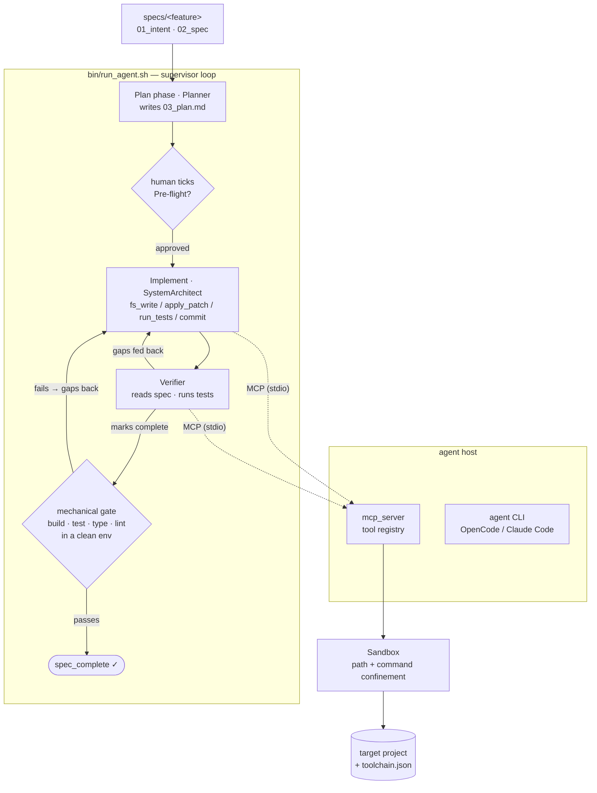

# Specwright

[](https://github.com/swancoder/specwright/actions/workflows/ci.yml)

> Spec-driven agent harness — drives AI coding agents (local or hosted) through
> plan → approve → implement → verify, with a mechanical gate that certifies "done" honestly.

## What is Specwright?

Specwright turns a **specification into working, verified code** by driving an AI coding agent
through a disciplined loop — and, crucially, by deciding *for itself* whether the result is
actually done.

You write the intent and spec. A **Planner** agent drafts an implementation plan; **you approve it**
by ticking its pre-flight checklist. A **SystemArchitect** agent then implements the feature,
touching the target project only through a small set of sandboxed [MCP](https://modelcontextprotocol.io)
tools. An independent **Verifier** reads the spec and runs the tests, and a **mechanical completion
gate** rebuilds the project from scratch and runs its type-checks and linters. The run is declared
complete **only when the code genuinely builds, tests, types and lints in a clean environment** —
not when the model says so.

That gate is the point. Across a four-model study (see `docs/adr/` and the audit reports), an
unguarded harness happily certified broken output as "done"; with the gate, the same weak local
model produces an honest *"not done"* instead. **A better harness can't make a weak model strong —
only honest.** Specwright runs the *identical* loop on a local open-weight model (via
[OpenCode](https://opencode.ai) + [Ollama](https://ollama.com)) or a hosted one
([Claude Code](https://docs.claude.com/en/docs/claude-code)), and on any tech stack (Python, PHP/JS,
Node/TypeScript, Java) via a per-project `toolchain.json`.

- Orientation and mandatory protocols: `CLAUDE.md`
- Technical reference: `docs/SPECS.md`
- Decision records (one per stage): `docs/adr/`

## Architecture



**Two gates make the verdict trustworthy.** The **approval gate** (a human ticking `03_plan.md`'s
pre-flight boxes) keeps the agent from building the wrong thing; the **completion gate** keeps it
from *claiming* the right thing was finished when it wasn't. Neither is lowered to fit the model.

**Components**

| Piece | Role |
|-------|------|
| `./harness` | The unified CLI and entry point — `install` (venv + deps), `run "<task>" …` (tags a `SESSION_ID`, tees the transcript to `.agent-harness/audit_logs/`, forwards to the supervisor), `ui` (read-only Streamlit Observer). |
| `bin/run_agent.sh` | The supervisor loop: preflight → plan/implement/verify → completion gate → retry, with dropped-tool-call recovery and a no-progress abort. Backend-agnostic (`AGENT_CMD=opencode\|claude`). |
| `bin/init_project.sh` | Scaffolds a new target (constitution, specs skeleton, `toolchain.json`, git baseline) for a chosen **stack** and **agent backend**. |
| `mcp_server/` | The MCP boundary the agent acts through: a strict tool registry (`fs_read/write/list`, `apply_patch`, `run_tests`, `git_commit_feature`, `run_toolchain_task`, `query_temporal_coupling`, …) with per-role gating. |
| `mcp_server/core/sandbox.py` | Confines every file and command to the target directory — no path traversal, scrubbed env, timeouts. The security boundary (agents get MCP tools only, never a raw shell). |
| `mcp_server/core/toolchain.py` | Resolves a target's `toolchain.json` (install/lint/test/build) or falls back to the Python default — the stack-agnostic execution layer. |
| `knowledge_graph/` | Incremental SQLite indexer computing **temporal coupling** (Jaccard co-change) from git history, surfaced to the agent as `query_temporal_coupling`. |
| `config/roles.yaml` | The `Planner` / `SystemArchitect` / `Verifier` personas and their allowed tools. |
| `bin/audit_log.py` · `bin/ui_dashboard.py` | Append-only JSONL session log and a read-only Streamlit **Observer** dashboard (timeline of agent turns, toolchain runs, and gate status) — launched by `./harness ui`. |
| `bin/completion_checks.py` | The mechanical gate: a hermetic build + test + type-check + lint, via the toolchain abstraction. |

## Quick start

The `./harness` CLI is the front door — install, run a session, watch it:
```bash
./harness install                                     # venv + deps (incl. streamlit) + audit dir
./harness run "add feedback endpoint" --spec 001 --target-dir ../my-app --phase plan
./harness ui                                          # read-only audit dashboard (Observer)
```
Each `run` tags a `SESSION_ID` and tees the transcript to `.agent-harness/audit_logs/<id>.log`;
`ui` only reads those logs, so sessions keep running in parallel. The underlying `bin/*` scripts
stay available directly:
```bash
./bin/init_project.sh --project-dir ../my-app --stack node-typescript --backend claude  # scaffold a new target
./bin/bootstrap_env.sh                       # venv + requirements; checks node/opencode/ollama/model
./bin/bootstrap_env.sh --target-dir <path>   # also pre-provision <target>/.venv from its requirements.txt
./bin/start_mcp.sh --target-dir <path>       # MCP server over stdio (+ SQLite graph)
./bin/run_agent.sh --spec <spec_id> --target-dir <path> [--skip-preflight] [--no-completion-checks]
./bin/run_agent.sh --spec <spec_id> --target-dir <path> --phase plan   # Planner writes+commits specs/<id>/03_plan.md
#   → human reviews the plan and ticks every '- [ ]' under '## Pre-flight'
./bin/run_agent.sh --spec <spec_id> --target-dir <path>                # implement→verify loop; succeeds only when the Verifier marks the spec complete
./bin/run_agent.sh --spec <spec_id> --target-dir <path> --dry-run   # show what would run
python3 -m knowledge_graph.indexer --incremental
pytest tests/
```

## TODO
- [x] `git init` done; Stage 2 and Stage 3 committed on `main` (`git log`).
- [x] `CLAUDE.md` build commands now reference `bin/start_mcp.sh` (Stage 7).
- [x] Add `tests/` directory and a first `pytest` smoke test (`tests/test_indexer_storage.py`).
- [x] Add `.gitignore` (venv, `CLAUDE.md`, `prompts-hist/`, SQLite DB); `.graphignore` lives in the *target* project.
- [x] ADR-001..004 written. (files linked from `CLAUDE.md` and `docs/SPECS.md` do not exist yet).
- [x] Stage 2: SQLite schema + `.graphignore` filter in `knowledge_graph/indexer.py` (ADR-002).
- [x] Stage 3: incremental indexer + self-healing + Jaccard query (ADR-003). Follow-ups: detect rewritten-but-not-pruned history via `git merge-base --is-ancestor`; rename tracking; don't wipe on transient git errors; `git log --all` includes abandoned branches.
- [x] Stage 4: MCP stdio server, 7 tools registered, `query_temporal_coupling` wired (ADR-004).
- [x] Stage 5: all six tools implemented behind `mcp_server/core/sandbox.py` (ADR-001). Follow-ups: OS-level sandbox (container) for `run_tests`; configurable test runner override; `fs_write`/`fs_list` tools if the agent loop needs them.
- [x] Stage 6: `bin/run_agent.sh` + `bin/harness_config.py`, `config/llm_backends.yaml` (ollama default), `config/roles.yaml` (SystemArchitect) (ADR-005). Follow-ups: pick the real agent CLI (Claude Code needs an Anthropic-protocol proxy in front of Ollama); `AGENT_CMD` override is the placeholder.
- [x] Stage 19: monitoring dashboard (ADR-018) — `bin/audit_log.py` appends structured JSONL events (one `O_APPEND` write per line, so a live reader only ever sees a torn final line); `harness run` emits `session_start`/`session_end`; `bin/ui_dashboard.py` is a read-only Streamlit Observer with a newest-first session picker, a chronological timeline (colored toolchain/gate status, payload/result in expanders), a robust parser, and refresh / native auto-refresh. Real events are wired end to end — `agent_turn` (each implementer attempt + Verifier run, both backends), `execute_toolchain_task` (the `run_toolchain_task` tool and the gate), and the `mechanical_gate` verdict, each timed with a `duration_ms` (agent turns paired as start + `agent_turn_done`) — via `mcp_server/core/audit.py`'s env-driven `emit_env` (`HARNESS_AUDIT_DIR`/`HARNESS_ACTOR` propagate down the process tree).
- [x] Stage 18: unified `./harness` CLI (ADR-017) — `install` (venv + deps incl. streamlit, verifies MCP entry points, prepares gitignored `.agent-harness/audit_logs/`), `run "<task>" [args]` (unique exported `SESSION_ID`, tees the transcript to the audit log, forwards flags to `run_agent.sh`, preserves its exit code), `ui` (read-only Streamlit Observer `bin/ui_dashboard.py` over the audit logs). Observer pattern — the UI never writes agent state, so sessions run in parallel.
- [x] Stage 17: `bin/init_project.sh` scaffolds a new target project — choose the stack (python|php-js|node-typescript|java-maven|java-gradle → copies the toolchain template) and the agent backend (opencode|claude + model) and directory; writes constitution/CLAUDE.md/specs skeleton/.gitignore + git baseline, prints the run commands (ADR-016).
- [x] Stage 16: toolchain abstraction (ADR-015) — a target `toolchain.json` (`{stack, commands:{install,lint,test,build}}`) overrides build/test/lint for both the agent and the gate; absent → Python default (venv/pip/mypy/ruff/pytest), unchanged. New capability-gated `run_toolchain_task` MCP tool returns ANSI-stripped, head/tail-truncated (≤4 KiB) JSON; `completion_checks.py` routes lint through it.
- [x] Stage 15: reliability hardening for weak local models (ADR-014) — model preflight (num_ctx + tool-calling probe, abort 6), dropped-tool-call recovery in the resume, tool-name + argument aliases (gated per role), mechanical completion gate (hermetic build + mypy/ruff before `spec_complete`), no-progress abort (7), shadow-dependency `fs_write` guard.
- [x] Stage 14: Claude Code backend (`AGENT_CMD=claude`, `--model sonnet` default) runs the identical plan→approve→implement→verify loop via `claude -p --output-format json`; roles applied as `--append-system-prompt` + `--allowedTools mcp__agent-harness__*` with built-ins disallowed (MCP-only); implementer resumed with `--resume <session_id>` (ADR-013). Open Code/generic paths unchanged.
- [x] Stage 13: implement phase is now an implementer→Verifier loop; success = `.agent-harness/spec_complete` (set by the read-only `Verifier` via the capability-gated `mark_spec_complete`, MCP `--enable-tool`), not the first commit; the Verifier's gap list feeds the next `--continue` (ADR-012). Follow-ups: second/stronger model for verification; `blocked` marker.
- [x] Stage 12: `--phase plan|implement`; `Planner` persona; approval gate on `03_plan.md` pre-flight checkboxes (`bin/plan_gate.py`, exit 4/5); MCP `--write-scope` enforced in `fs_write`/`fs_apply_patch`; per-role tool exposure in Open Code (ADR-011). Follow-ups: `blocked` marker; branch creation as a harness step.
- [x] Stage 11: `fs_read(start_line,end_line)`; `Sandbox.resolve` rejects `* ? [ ]`; `*.db/*.sqlite/*.sqlite3/*.db3` never staged; `run_tests(timeout_seconds=60, ≤600)` with explicit `timeout_message`; persona: milestone commits + honesty/stuck rule (ADR-010). Follow-ups: `blocked` marker so the supervisor stops nudging an honest stop.
- [x] Stage 10: `run_tests` runs `<target>/.venv/bin/python -m pytest`, creating the venv and installing `requirements.txt` (re-installs on change, self-heals pytest); `bootstrap_env.sh --target-dir`; anti-shadowing persona rule; `MAX_RETRIES=5` (ADR-009). Follow-ups: `pyproject.toml` (`pip install -e .`) support; interpreter version from the constitution.
- [x] Stage 9: supervisor loop in `run_agent.sh` — `git_commit_feature` writes `.agent-harness/run_successful`; up to `MAX_RETRIES=3` attempts, resumes with `opencode run --continue`; exit 0/3 (ADR-008). Follow-ups: a `blocked` marker so legitimate stops aren't retried; loop on plan milestones rather than first commit.
- [x] Stage 8: `fs_list` (JSON, excludes `.git`/`.venv`/`__pycache__`/`node_modules`/`.agent-harness`…) and `fs_write` (atomic, creates parents) behind `Sandbox`; 9 tools total (ADR-007). Follow-ups: configurable exclusions; optional `.gitignore` awareness; test-lock convention on the harness side.
- [x] Stage 7: `bin/bootstrap_env.sh`; Open Code is the agent CLI (`opencode run --agent SystemArchitect`, per-target `.agent-harness/opencode.json`); default model `gpt-oss:20b`; Anthropic env removed (ADR-006). Follow-ups: native Ollama adapter to separate gpt-oss reasoning; end-to-end run on a real spec.
- [ ] Fill `docs/SPECS.md` sections marked _TODO_.
- [ ] Rewrite the scaffold generator script later (deferred).
